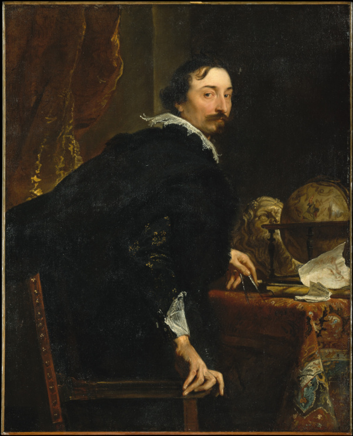
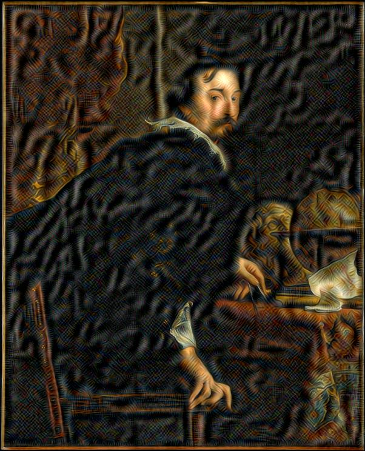

# DeepDream

This is direct DeepDream implementation from the Hackernoon article [Deep Dream with TensorFlow: A Practical guide to build your first Deep Dream Experience](https://hackernoon.com/deep-dream-with-tensorflow-a-practical-guide-to-build-your-first-deep-dream-experience-f91df601f479) by Magnus Erik Hvass Pedersen.  This is the code from his [Tensorflow Tutorial #14 - Deepdream](https://github.com/Hvass-Labs/TensorFlow-Tutorials/blob/master/14_DeepDream.ipynb) Jupyter Notebook.

## Table of Contents

- [Installation](#installation)
- [Usage](#usage)
- [Example](#example)
- [Support](#support)
- [References](#references)

## Installation

Install either [Anaconda](https://www.anaconda.com/distribution/) or [Miniconda](https://docs.conda.io/en/latest/miniconda.html)

Windows Users: After install, add the path of your Anaconda3 and Anaconda3/Scripts folder to your Environmental Variables in System Properties.  The location of those two directories depend on install.  It's also recommended to place those new directories above %USERROFILE%\AppData\Local\Microsoft\WindowsApps.

## Creating Deepdream Environment

# Recommended: Use conda environment.yml file

```sh
conda env create -f environment.yml
conda activate deepdream
```

# Alternative: Install packages using conda

```sh
conda create --name deepdream python=3.5 -y
conda install --name deepdream tensorflow --channel conda-forge -y
conda install --name deepdream pillow --channel conda-forge -y
conda install --name deepdream scipy --channel conda-forge -y
conda activate deepdream
```

## Usage

Place an image for conversion into img/input.jpg.

```sh
python deepdream.py
```

the resulting file is placed in img/output.jpg.

## Example




## Support

Jypiter Notebook: [Tensorflow Tutorial #14 - Deepdream](https://github.com/Hvass-Labs/TensorFlow-Tutorials/blob/master/14_DeepDream.ipynb) for support.

## References
Image - Public Domain from The Met's Open Access Artwork - [Lucas van Uffel (died 1637)](https://www.metmuseum.org/art/collection/search/436253) _- scaled down for increased speed_

Jupyter Notebook: [Tensorflow Tutorial #14 - Deepdream](https://github.com/Hvass-Labs/TensorFlow-Tutorials/blob/master/14_DeepDream.ipynb)

Hackernoon Article: [Deep Dream with TensorFlow: A Practical guide to build your first Deep Dream Experience](https://hackernoon.com/deep-dream-with-tensorflow-a-practical-guide-to-build-your-first-deep-dream-experience-f91df601f479).

[Magnus Erik Hvass Pedersen](http://www.hvass-labs.org/)